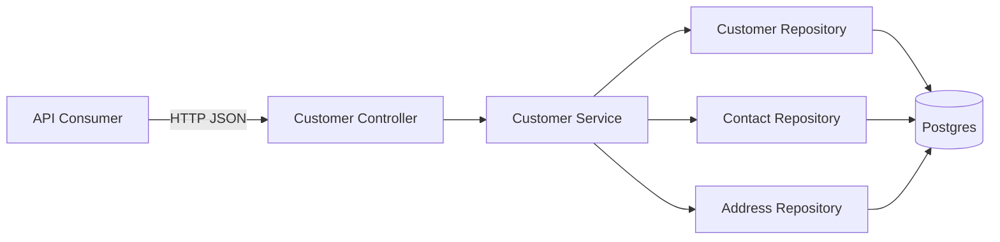

# TDD - Customer API Module

| Field           | Value                                   |
| --------------- | --------------------------------------- |
| Tech Lead       | TBD                                     |
| Product Manager | TBD                                     |
| Team            | Backend/API                             |
| Epic/Ticket     | TBD                                     |
| Figma/Design    | Out of scope for this API-only document |
| Status          | Implemented                             |
| Created         | 2026-05-16                              |
| Last Updated    | 2026-05-21                              |

## Context

`Customer` is the central commercial record in the CRM. It represents a company or individual with whom there is, or may be, a commercial relationship. It can exist before sales, budgets, opportunities, finance records, or mature commercial history.

The source of truth for business language and rules is [domain.md](./domain.md). This technical design translates that domain understanding into the API package only, under `apps/api`. Frontend implementation, UI flows, grids, and screen state are intentionally left for a separate technical design.

Current API package is a NestJS backend with TypeORM and Postgres. It has global config and DB connection setup, but no business domain modules yet. Customer module will establish first domain-oriented API pattern for future modules like contacts, products, budgets, opportunities, sales, finance, and reports.

## Problem Statement & Motivation

### Problems Solved

- **No Customer API exists yet**: API cannot create, list, update, archive, or retrieve central CRM customer records.
  - Impact: frontend and future domains have no stable backend contract for core commercial data.
- **Customer rules must be preserved outside UI**: Progressive registration, non-blocking duplicates, archive over delete, and operational status need server-side ownership.
  - Impact: if rules live only in frontend, future integrations or alternate clients can corrupt domain behavior.
- **Future domains need stable references**: Opportunities, budgets, sales, finance, reports, contacts, and addresses will depend on Customer identifiers and status semantics.
  - Impact: weak Customer API design creates coupling and rework across later modules.

### Why Now

- Customer is foundational for CRM workflows.
- API package already has DB infrastructure and is ready for first domain module.
- Frontend Customer work needs backend contracts before screen-level design can be implemented cleanly.

### Impact Of Not Solving

- **Business**: users cannot persist central commercial records.
- **Technical**: later domains may invent inconsistent Customer assumptions.
- **Users**: cannot start fast, spreadsheet-like progressive registration flow.

## Scope

### In Scope - API V1

- Customer module inside `apps/api`.
- Customer create with only `name` required.
- Customer list with active-only default visibility.
- Customer retrieve by ID.
- Customer update for editable registration fields.
- Customer status transition between `active`, `inactive`, `archived`, and `blocked`.
- Archive/unarchive semantics without operational hard delete.
- Contact and Address removal policy: hard delete only when no dependent records exist; soft delete when related records/history exist.
- Basic duplicate-signal support without blocking creation.
- Contact subresource owned by Customer.
- Address subresource owned by Customer.
- Strictly one default address per Customer.
- Registration completeness summary for API consumers.
- Database schema and migrations for Customer, Contact, and Address.
- Unit and integration tests for API behavior and domain rules.

### Out Of Scope - API V1

- Frontend screens, forms, grids, filters, URL state, and UI validation.
- Pipeline stage, lead/prospect maturity, board, or opportunity tracking.
- Sales, budgets, finance, credit, invoicing, or payment operations.
- Customer hard delete as user-facing operational flow.
- Auth/user ownership and multi-tenant authorization model.
- Full fiscal profile, tax rules, state registration, contributor indicator, or invoice-specific validation.
- Activity timeline, calls, meetings, follow-ups, and interaction history.
- Automatic merge of duplicate Customers.
- Shared business DTOs/contracts in `packages/shared`.

### Future Considerations

- Dedicated duplicate review workflow.
- Customer merge flow with audit trail.
- Fiscal data module or extension.
- Activity/history module.
- Pipeline integration.
- Sales/finance checks that respect `blocked`.
- Multi-tenant ownership and access control.

## Technical Solution

### Architecture Overview

Customer API follows existing NestJS MVC-oriented architecture:

- **Controller boundary**: HTTP routes, request validation, response shape.
- **Service/application layer**: Customer use cases and domain rule enforcement.
- **Persistence layer**: TypeORM repositories over Postgres tables.
- **Package boundary**: keep Customer API DTOs/contracts inside `apps/api`; `packages/shared` remains for quality gates/config such as ESLint, TypeScript, SonarQube, and related tooling.



### Key Components

- **Customer Module**: owns Customer API routes, service, persistence registration, DTOs, and tests.
- **Customer Service**: owns Customer lifecycle rules, status transitions, completeness calculation, duplicate signals, and aggregate-level updates.
- **Contact Service or Customer-owned Contact Use Cases**: manages contacts attached to one Customer.
- **Address Service or Customer-owned Address Use Cases**: manages addresses attached to one Customer.
- **Persistence Model**: stores Customer, Contact, and Address as separate tables with Customer ownership.

### Domain Rules Enforced By API

- `name` is required for Customer creation.
- Customer may be incomplete after creation.
- Missing `email`, `phone`, address, contact, or fiscal data does not block Customer creation.
- `name` is not unique.
- Duplicate detection is advisory, not blocking.
- Default list returns `active` Customers.
- Caller can explicitly include `inactive`, `blocked`, and `archived`.
- `archived` is not deletion.
- `blocked`, `inactive`, and `archived` still allow Customer-domain maintenance.
- `blocked` only signals other domains to block sensitive operations.
- Contact belongs to exactly one Customer.
- Same real-world person linked to two Customers is stored as two Contact records.
- Address belongs to exactly one Customer.
- More than one address of same type is allowed.
- Exactly one default address is allowed per Customer.
- V1 does not require auth/user ownership.
- Contact and Address removal hard-deletes records only when no dependent records exist; otherwise removal soft-deletes them.

### API Endpoints

Base path: `/customers`

| Endpoint                              | Method | Description                                   |
| ------------------------------------- | ------ | --------------------------------------------- |
| `/customers`                          | POST   | Create Customer with progressive registration |
| `/customers`                          | GET    | List Customers, active by default             |
| `/customers/:id`                      | GET    | Retrieve Customer detail                      |
| `/customers/:id`                      | PATCH  | Update editable Customer fields               |
| `/customers/:id/status`               | PATCH  | Change operational status                     |
| `/customers/:id/archive`              | POST   | Archive Customer                              |
| `/customers/:id/unarchive`            | POST   | Return archived Customer to active            |
| `/customers/:id/contacts`             | POST   | Create Contact for Customer                   |
| `/customers/:id/contacts`             | GET    | List Customer contacts                        |
| `/customers/:id/contacts/:contactId`  | PATCH  | Update Contact                                |
| `/customers/:id/contacts/:contactId`  | DELETE | Remove Contact using V1 removal policy        |
| `/customers/:id/addresses`            | POST   | Create Address for Customer                   |
| `/customers/:id/addresses`            | GET    | List Customer addresses                       |
| `/customers/:id/addresses/:addressId` | PATCH  | Update Address                                |
| `/customers/:id/addresses/:addressId` | DELETE | Remove Address using V1 removal policy        |

Contact and Address deletion in V1 follows dependency-aware removal. If no dependent records/history exist, the nested record can be hard deleted. If dependent records/history exist, it must be soft deleted and hidden from default nested lists. Customer hard deletion remains out of scope.

### API Query Behavior

| Query             | Default               | Meaning                                                          |
| ----------------- | --------------------- | ---------------------------------------------------------------- |
| `status`          | `active`              | Filter by one or more statuses                                   |
| `includeArchived` | `false`               | Include archived records in broad searches                       |
| `search`          | none                  | Search by Customer name, email, phone, and future indexed fields |
| `page`            | `1`                   | Pagination page                                                  |
| `pageSize`        | project default       | Bounded page size                                                |
| `sort`            | `name` or `createdAt` | Stable list ordering                                             |

Default list behavior must not return archived, inactive, or blocked records unless caller asks for them.

List responses use page-based pagination metadata:

```json
{
  "data": [],
  "pagination": {
    "page": 1,
    "pageSize": 25,
    "total": 123,
    "totalPages": 5,
    "hasMore": true
  }
}
```

### Example Contracts

Create Customer:

```json
{
  "name": "ACME Ltda",
  "email": "financeiro@acme.example",
  "phone": "+55 11 99999-0000",
  "notes": "Prefers email contact."
}
```

Create response:

```json
{
  "id": "7e1a7fe2-7db4-4927-a448-36a339629d90",
  "name": "ACME Ltda",
  "status": "active",
  "email": "financeiro@acme.example",
  "phone": "+55 11 99999-0000",
  "notes": "Prefers email contact.",
  "completeness": {
    "hasPrimaryChannel": true,
    "hasAddress": false,
    "pending": ["address"]
  },
  "duplicateSignals": [],
  "createdAt": "2026-05-16T10:00:00Z",
  "updatedAt": "2026-05-16T10:00:00Z"
}
```

Minimal create:

```json
{
  "name": "Maria Silva"
}
```

Contact:

```json
{
  "name": "Joao Silva",
  "role": "financial",
  "email": "joao@acme.example",
  "phone": "+55 11 98888-0000",
  "notes": "Handles invoices."
}
```

Address:

```json
{
  "type": "billing",
  "isDefault": true,
  "line1": "Av. Paulista, 1000",
  "line2": "10 andar",
  "city": "Sao Paulo",
  "state": "SP",
  "postalCode": "01310-100",
  "country": "BR"
}
```

### Data Model

#### `customers`

| Field         | Type               | Notes                                       |
| ------------- | ------------------ | ------------------------------------------- |
| `id`          | UUID               | Primary key                                 |
| `name`        | Text               | Required, not unique                        |
| `status`      | Enum               | `active`, `inactive`, `archived`, `blocked` |
| `email`       | Text nullable      | Main Customer email                         |
| `phone`       | Text nullable      | Main Customer phone                         |
| `notes`       | Text nullable      | General notes                               |
| `created_at`  | Timestamp          | Creation time                               |
| `updated_at`  | Timestamp          | Last update time                            |
| `archived_at` | Timestamp nullable | Set when status becomes `archived`          |

Indexes:

- `status` for default operational lists.
- `name` for search and sorting.
- `email` where present for search and duplicate signals.
- `phone` where present for search and duplicate signals.
- `created_at` for stable pagination.

#### `customer_contacts`

| Field         | Type               | Notes                                               |
| ------------- | ------------------ | --------------------------------------------------- |
| `id`          | UUID               | Primary key                                         |
| `customer_id` | UUID               | Required FK to Customer                             |
| `name`        | Text               | Required                                            |
| `role`        | Enum               | `commercial`, `financial`, `other`                  |
| `email`       | Text nullable      | Contact email                                       |
| `phone`       | Text nullable      | Contact phone                                       |
| `notes`       | Text nullable      | Contact-specific notes                              |
| `deleted_at`  | Timestamp nullable | Set only when soft deleted due to dependent records |
| `created_at`  | Timestamp          | Creation time                                       |
| `updated_at`  | Timestamp          | Last update time                                    |

Indexes:

- `customer_id`.
- `(customer_id, role)` for role filtering.
- `deleted_at` for default nested lists.
- `email` and `phone` where present for search.

#### `customer_addresses`

| Field         | Type               | Notes                                               |
| ------------- | ------------------ | --------------------------------------------------- |
| `id`          | UUID               | Primary key                                         |
| `customer_id` | UUID               | Required FK to Customer                             |
| `type`        | Enum               | `main`, `shipping`, `billing`, `other`              |
| `is_default`  | Boolean            | Strict default marker per Customer                  |
| `line1`       | Text nullable      | Address line                                        |
| `line2`       | Text nullable      | Address complement                                  |
| `city`        | Text nullable      | City                                                |
| `state`       | Text nullable      | State/region                                        |
| `postal_code` | Text nullable      | Postal/ZIP code                                     |
| `country`     | Text nullable      | Country code or name                                |
| `deleted_at`  | Timestamp nullable | Set only when soft deleted due to dependent records |
| `created_at`  | Timestamp          | Creation time                                       |
| `updated_at`  | Timestamp          | Last update time                                    |

Indexes:

- `customer_id`.
- `(customer_id, type)`.
- Unique default address per Customer, excluding soft-deleted records.
- `deleted_at` for default nested lists.

### Status Model

| Status     | Meaning                                         | Customer-domain maintenance allowed | Default list |
| ---------- | ----------------------------------------------- | ----------------------------------- | ------------ |
| `active`   | Normal operational use                          | Yes                                 | Included     |
| `inactive` | Preserved but not current                       | Yes                                 | Excluded     |
| `archived` | Preserved for history, hidden by default        | Yes                                 | Excluded     |
| `blocked`  | Other domains should block sensitive operations | Yes                                 | Excluded     |

### Duplicate Signals

Duplicate handling is advisory:

- API may return possible duplicates on create/update/list detail.
- Matching can use normalized name, email, phone, and later document data.
- Creation must not fail only because another Customer has same name.
- Automatic merge is not part of V1.

### Completeness Summary

Completeness is advisory:

| Pending key       | Condition                                   |
| ----------------- | ------------------------------------------- |
| `primary_channel` | no Customer `email` and no Customer `phone` |
| `address`         | no address linked                           |

CPF/CNPJ and legal fiscal fields are not V1 completeness criteria.

## Security Considerations

Customer data contains PII and commercial context. Security requirements:

- Validate all request inputs at HTTP boundary.
- Limit field sizes to prevent abuse and accidental oversized notes.
- Normalize but do not overvalidate user-entered phone/name data in V1.
- Never log full request bodies for Customer write operations.
- Redact email, phone, notes, address lines, and future fiscal identifiers from error logs.
- Use parameterized DB queries through ORM/repository APIs.
- V1 does not require auth/user ownership.
- Design for future auth and tenant/account scoping; avoid hard-to-change global Customer access assumptions.
- Keep Customer hard delete unavailable through public operational API.

Compliance posture:

- LGPD/GDPR-relevant data may exist in Customer, Contact, and Address records.
- Deletion/export/privacy workflows are out of scope for V1 but must be planned before external production use if compliance requires them.

## Testing Strategy

| Test Type         | Scope                                                   | Required Coverage     |
| ----------------- | ------------------------------------------------------- | --------------------- |
| Unit tests        | Services, completeness, status rules, duplicate signals | Domain behavior       |
| Integration tests | HTTP routes, validation, DB persistence, module wiring  | Critical API paths    |
| Regression tests  | Each fixed Customer rule bug                            | Bug-specific behavior |

### Required Scenarios

- Create Customer with only `name` succeeds.
- Create Customer without `name` fails validation.
- Duplicate `name` does not block creation.
- Default list returns only `active`.
- Explicit status filter can include `inactive`, `blocked`, and `archived`.
- Archive changes status and excludes Customer from default list.
- Unarchive returns Customer to active.
- `blocked`, `inactive`, and `archived` Customer can still be updated inside Customer module.
- Contact belongs to one Customer and cannot be updated through another Customer route.
- Address belongs to one Customer and cannot be updated through another Customer route.
- Only one default address can exist per Customer.
- Contact and Address removal hard-deletes unreferenced records.
- Contact and Address removal soft-deletes referenced records.
- Soft-deleted Contact and Address records are hidden from default nested lists.
- Completeness summary reports missing primary channel and address.
- API responses do not expose persistence-only fields.

## Monitoring & Observability

### Metrics

| Metric                              | Type             | Alert Threshold                     |
| ----------------------------------- | ---------------- | ----------------------------------- |
| `customer_api.request_count`        | Counter          | Sudden drop during business hours   |
| `customer_api.error_rate`           | Error rate       | > 1% for 5 minutes                  |
| `customer_api.latency_p95`          | Latency          | > 500ms for 5 minutes               |
| `customer_api.create_count`         | Business counter | Unexpected zero during active usage |
| `customer_api.archive_count`        | Business counter | Sudden spike                        |
| `customer_api.db_query_latency_p95` | Latency          | > 100ms for 5 minutes               |

### Structured Logs

Log:

- route, method, status, duration.
- Customer ID for successful read/write operations.
- actor/user ID only after auth exists.
- status transitions.
- validation failures as category, not raw body.

Do not log:

- full notes.
- full address lines.
- full phone/email values unless redacted.
- future fiscal identifiers.

### Alerts

| Alert                  | Severity | Action                                         |
| ---------------------- | -------- | ---------------------------------------------- |
| Error rate > 5%        | High     | Investigate and rollback if release-related    |
| p95 latency > 1s       | Medium   | Check DB indexes, slow queries, app saturation |
| DB connection failures | High     | Verify Postgres and API deployment health      |
| Archive spike          | Medium   | Check UI/API misuse or bulk operation bug      |

## Rollback Plan

### Deployment Strategy

- Release Customer API behind normal backend deployment pipeline.
- Prefer additive DB migrations for V1 tables.
- Keep frontend disabled until API smoke tests pass.
- Avoid destructive schema changes in V1.

### Rollback Triggers

| Trigger                                    | Action                                                                   |
| ------------------------------------------ | ------------------------------------------------------------------------ |
| API error rate > 5% after release          | Roll back API deployment                                                 |
| Customer create/update corrupts data       | Disable API consumers and roll back deployment                           |
| Migration failure                          | Stop deployment and restore previous DB state from migration/backup plan |
| Latency p95 > 1s due to Customer endpoints | Roll back or disable exposed route access                                |

### Rollback Steps

1. Disable new API consumers or route exposure if controlled separately.
2. Revert API deployment to previous stable version.
3. If schema migration caused failure, apply reviewed rollback migration or restore from pre-migration backup.
4. Verify app health, DB health, and Customer routes.
5. Record incident and add regression tests before re-release.

## Risks

| Risk                                      | Impact | Probability | Mitigation                                                                          |
| ----------------------------------------- | ------ | ----------- | ----------------------------------------------------------------------------------- |
| Customer model becomes too broad          | High   | Medium      | Keep fiscal, pipeline, activity, sales, and finance concerns out of V1              |
| Customer hard delete added accidentally   | High   | Low         | Exclude public Customer delete endpoint; tests enforce archive behavior             |
| Duplicate blocking hurts real workflows   | Medium | Medium      | Make duplicate detection advisory only                                              |
| Status semantics misused by other modules | Medium | Medium      | Document `blocked` as signal for other domains, not Customer maintenance lock       |
| PII leaked in logs                        | High   | Low         | Redaction rules and log tests/reviews                                               |
| Slow list/search as data grows            | Medium | Medium      | Add indexes, bounded pagination, query tests                                        |
| Frontend/API contract drift               | Medium | Medium      | Keep API contracts documented here; avoid shared business code in `packages/shared` |

## Implementation Plan

| Phase                 | Task                          | Description                                                                      | Owner   | Status | Estimate |
| --------------------- | ----------------------------- | -------------------------------------------------------------------------------- | ------- | ------ | -------- |
| Phase 1 - Contracts   | API contract finalization     | Confirm endpoints, request/response shapes, pagination, status semantics         | Backend | DONE   | 0.5d     |
| Phase 1 - Contracts   | DB schema finalization        | Confirm Customer, Contact, Address tables, soft-delete fields, and indexes       | Backend | DONE   | 0.5d     |
| Phase 2 - Persistence | Migrations/entities           | Add Postgres schema through TypeORM-compatible migration approach                | Backend | DONE   | 1d       |
| Phase 2 - Persistence | Repository boundaries         | Add persistence access for Customer, Contact, Address                            | Backend | DONE   | 1d       |
| Phase 3 - Domain/API  | Customer service              | Create, list, retrieve, update, status, archive, completeness, duplicate signals | Backend | DONE   | 2d       |
| Phase 3 - Domain/API  | Contact/address use cases     | Nested create/list/update/delete scoped by Customer                              | Backend | DONE   | 2d       |
| Phase 3 - Domain/API  | Controllers/DTOs              | HTTP routes, validation, response serialization                                  | Backend | DONE   | 1.5d     |
| Phase 4 - Tests       | Unit tests                    | Service rules and pure behavior                                                  | Backend | DONE   | 1.5d     |
| Phase 4 - Tests       | Integration tests             | HTTP boundary, DB persistence, validation, routing                               | Backend | DONE   | 2d       |
| Phase 5 - Hardening   | Observability/security review | Logs, redaction, metrics, PII review                                             | Backend | PARTIAL | 1d       |
| Phase 5 - Release     | Staging validation            | Smoke test migration and API behavior                                            | Backend | PARTIAL | 0.5d     |

Total estimate: about 13 days.

## Implementation Notes

Implemented on 2026-05-21 in `apps/api`.

### Module Structure

- Added `CustomersModule` and registered it in `AppModule`.
- Added `CustomersController` for the `/customers` HTTP boundary.
- Added `CustomersService` for Customer, Contact, Address, status, archive, completeness, duplicate-signal, default-address, and removal rules.
- Added TypeORM entities for `customers`, `customer_contacts`, and `customer_addresses`.
- API response objects are mapped explicitly from entities, so persistence-only fields such as `deletedAt` are not returned.

### Validation And Transformation

- Installed `class-validator` and `class-transformer` in `@crm/api`.
- Added global validation in `main.ts` through `configureValidation(app)`.
- Validation settings:
  - `transform: true`
  - `whitelist: true`
  - `forbidNonWhitelisted: true`
- DTOs trim string inputs, validate enums, bound string sizes, transform pagination query params to numbers, and support comma-separated status filters.

### Persistence And Migrations

- Added TypeORM DataSource config at `apps/api/src/data-source.ts`.
- Added migration `CreateCustomerTables1715840000000`.
- Migration creates Customer, Contact, and Address tables; enum types; FKs; timestamps; soft-delete columns for nested records; operational indexes; and a partial unique index enforcing one non-deleted default address per Customer.
- `synchronize` remains disabled in the runtime app.
- Migration commands:

```bash
pnpm --filter @crm/api build
pnpm --filter @crm/api migration:run
pnpm --filter @crm/api migration:revert
```

### Removal Policy

- Contact and Address removal now uses an injectable `CustomerRemovalDependencyProbe`.
- The default V1 probe reports no dependencies, so current removals hard-delete unreferenced nested records.
- Service behavior already supports the future dependency branch: when the probe reports dependencies, removal sets `deletedAt` and default nested lists hide the record.

### Tests And Validation

- Added unit tests for Customer service behavior, duplicate signals, completeness, archive/unarchive maintenance, ownership checks, and soft-delete branch behavior.
- Added Postgres-backed integration tests for HTTP validation, create/list/update/status/archive/unarchive, Contact and Address ownership, default-address uniqueness, and default hard deletion.
- Validated with:

```bash
pnpm --filter @crm/api typecheck
pnpm --filter @crm/api lint
pnpm --filter @crm/api test:unit
pnpm --filter @crm/api test:integration
```

### Remaining Hardening

- Metrics, structured request logging, redaction-specific log tests, and deployment/staging smoke checks are still release-hardening work.
- Auth, tenant scoping, fiscal profile, merge workflow, Customer hard delete, frontend screens, and shared business DTOs remain out of scope for V1.

## Dependencies

| Dependency          | Type            | Status              | Risk   |
| ------------------- | --------------- | ------------------- | ------ |
| Customer domain doc | Domain          | Ready               | Low    |
| NestJS API app      | Internal        | Ready baseline      | Low    |
| TypeORM + Postgres  | Infrastructure  | Configured baseline | Medium |
| Auth/user context   | Internal        | Not required for V1 | Low    |
| Frontend contracts  | Future consumer | Out of scope here   | Low    |

## Decisions From Open Questions

| #   | Question                                                                                              | Decision                                                                                                                                              |
| --- | ----------------------------------------------------------------------------------------------------- | ----------------------------------------------------------------------------------------------------------------------------------------------------- |
| 1   | Does V1 require auth/user ownership, or will this wait for project-wide auth?                         | V1 does not require auth/user ownership.                                                                                                              |
| 2   | Should Contact and Address deletion be hard delete, soft delete, or archive-like removal?             | Hard delete when no dependent records exist; soft delete when dependent records/history exist.                                                        |
| 3   | Should address default be strictly unique per Customer and type in V1?                                | Yes. Exactly one default address per Customer in V1.                                                                                                  |
| 4   | Which pagination style should be standard for API modules: page/pageSize or cursor?                   | Standard API pagination uses `page`, `pageSize`, `total`, `totalPages`, and `hasMore`.                                                                |
| 5   | Should stable DTOs be placed in `packages/shared` immediately or only when web package consumes them? | No shared business DTOs/contracts. `packages/shared` is reserved for quality gates/config such as ESLint, TypeScript, SonarQube, and related tooling. |
