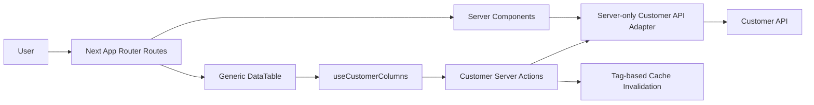

# TDD - Customer Frontend Module

| Field           | Value        |
| --------------- | ------------ |
| Tech Lead       | TBD          |
| Product Manager | TBD          |
| Team            | Frontend/Web |
| Epic/Ticket     | TBD          |
| Figma/Design    | TBD          |
| Status          | Draft        |
| Created         | 2026-05-22   |
| Last Updated    | 2026-05-22   |

## Context

`Customer` is the central commercial record in the CRM. It represents a company or individual with whom there is, or may be, a commercial relationship. The canonical business language and rules are documented in [domain.md](./domain.md), and the implemented backend contract is documented in [api-technical-design.md](./api-technical-design.md).

This document defines the frontend design for the Customer module in `apps/web`. The frontend must preserve the domain decisions already implemented in the API package: progressive registration, `active` records by default, archive instead of operational hard delete, advisory duplicate signals, editable Customer records regardless of operational status, and nested Contact/Address management scoped to one Customer.

The web package is a Next.js App Router application using TypeScript, React, shadcn/ui, Tailwind CSS, and Zod. The Customer frontend should use native React and Next.js features first: Server Components for reads, Server Actions for mutations, `useActionState` and `useFormStatus` for form state, Cache Components with `use cache`, and tag-based cache invalidation. Additional packages should be introduced only when they are necessary for the feature.

Because CRM users are expected to be familiar with spreadsheet-style workflows, the Customer list must support dense, scalable grid interactions and inline editing for selected low-risk fields. The design pillar is performance and scale, with clean code, low coupling, high cohesion, simple abstractions, and explicit boundaries.

## Problem Statement & Motivation

### Problems Solved

- **No Customer frontend exists yet**: users cannot create, search, update, archive, or enrich Customer records from the web application.
  - Impact: the implemented Customer API cannot be used by end users.
- **Customer workflows require fast progressive registration**: users need to create a Customer with only `name`, then enrich the record over time with email, phone, contacts, addresses, and notes.
  - Impact: forcing complete forms upfront would conflict with the domain model and spreadsheet-like user expectations.
- **Operational CRM lists need scalable table behavior**: Customer records will become a high-volume operational dataset.
  - Impact: a basic card/list UI would not scale for scanning, sorting, pagination, selection, or inline corrections.
- **Frontend/API contract drift is a risk**: the API module is already implemented and owns domain rules.
  - Impact: duplicating business rules loosely in UI code can create inconsistent behavior and race conditions.

### Why Now

- Customer API V1 has been implemented and tested.
- Customer is foundational for future CRM modules such as pipeline, opportunities, sales, finance, reporting, contacts, addresses, and fiscal data.
- The frontend package is still small, so the Customer module can establish the first scalable App Router pattern for domain screens.

### Impact Of Not Solving

- **Business**: users cannot manage the central commercial record in the CRM.
- **Technical**: future frontend modules may invent inconsistent data-fetching, form, and table patterns.
- **Users**: workflows remain disconnected from the spreadsheet-like editing model expected by the domain.

## Scope

### In Scope - Frontend V1

- Upgrade frontend runtime baseline to `next@16.2.x`, `react@19.2.6`, and `react-dom@19.2.6`.
- Enable Next.js Cache Components so Customer reads can use `use cache`.
- Route-level Customer UI enable/disable gate using simple environment/config.
- Customer routes:
  - `/customers`
  - `/customers/new`
  - `/customers/[id]`
- Server-only Customer API adapter in `apps/web`.
- Web-local Customer TypeScript contracts and Zod schemas.
- Customer list with server-side pagination, sorting, search, and filters driven by URL search params.
- Generic reusable `DataTable` infrastructure built with shadcn/ui table composition and TanStack Table.
- Customer-specific column hook, e.g. `useCustomerColumns()`.
- Excel-like inline editing for `name`, `email`, `phone`, and `status`.
- `status` inline editing through shadcn `Select`.
- Single-field inline save actions.
- Limited bulk actions:
  - bulk archive;
  - bulk status change.
- Minimal Customer create flow requiring only `name`.
- Redirect from successful create to `/customers/[id]`.
- Customer detail with stacked sections:
  - overview/core fields;
  - contacts;
  - addresses.
- Contact and Address list/add/edit/remove flows scoped to Customer detail.
- Contact and Address add/edit through shadcn `Sheet`.
- Contact and Address removal confirmation through shadcn `AlertDialog`.
- Non-blocking duplicate signal warnings.
- Completeness indicators for missing primary channel and address.
- Accessibility and keyboard behavior for table and editable cells.
- Focused unit/component tests and Playwright E2E coverage for critical workflows.

### Out Of Scope - Frontend V1

- Auth, user ownership, tenant scoping, or authorization UI.
- Generated OpenAPI client/types.
- Moving business DTOs/contracts into `packages/shared`.
- Virtualized Customer grid.
- Infinite scrolling.
- Optimistic Customer list insertion or optimistic status mutation.
- Inline editing for `notes`, contacts, or addresses in the list grid.
- Bulk hard delete, bulk merge, or bulk nested-resource edits.
- Customer merge workflow.
- Full fiscal profile UI.
- Pipeline, opportunity, sales, finance, invoicing, or activity timeline screens.
- External feature-flag service.
- Modal-only canonical navigation for Customer routes.

### Future Considerations

- OpenAPI/codegen if multiple consumers make contract drift costly.
- Virtualization or infinite scrolling if product requirements move beyond bounded server-side pages.
- Inline editing for nested resources if usage shows Contact/Address editing must become spreadsheet-like.
- Tabs on Customer detail after additional sections such as activity, fiscal data, sales, finance, or pipeline history are introduced.
- Auth/session/tenant propagation through the server-only adapter.
- Dedicated duplicate review and merge workflows.

## Technical Solution

### Architecture Overview

Customer frontend follows a server-first App Router design:

- **Routes and Server Components**: own read flows, URL search param parsing, and page composition.
- **Server Actions**: own mutations, Zod validation, API adapter calls, and cache invalidation.
- **Server-only API adapter**: centralizes `apps/api` communication, request normalization, response parsing, expected error mapping, cache tags, and future auth context propagation.
- **Feature contracts/schemas**: local to `apps/web` Customer feature; no shared DTO package in V1.
- **Generic DataTable infrastructure**: reusable CRM grid primitive with TanStack Table and shadcn UI composition.
- **Customer columns**: feature-specific column definitions through `useCustomerColumns()`.
- **Client Components**: used only for browser-required interaction such as editable cells, table selection, column visibility, dropdowns, sheets, dialogs, and pending cell state.

### Runtime And Framework Baseline

The Customer frontend depends on modern React and Next.js features. Before Customer implementation, `@crm/web` should use:

| Package     | Target   | Reason                                    |
| ----------- | -------- | ----------------------------------------- |
| `next`      | `16.2.x` | Cache Components and `use cache` baseline |
| `react`     | `19.2.6` | Current React 19 feature baseline         |
| `react-dom` | `19.2.6` | Must match React runtime                  |

`next.config.ts` should enable Cache Components. This is a prerequisite because Customer reads should be cacheable by explicit data function and invalidated by tags after mutations.

### Routes

| Route             | Responsibility                                                                                                  |
| ----------------- | --------------------------------------------------------------------------------------------------------------- |
| `/customers`      | Customer list, search, filters, pagination, sorting, create entry point, bulk actions                           |
| `/customers/new`  | Minimal progressive create form                                                                                 |
| `/customers/[id]` | Customer detail, core editing, archive/unarchive, duplicate/completeness signals, nested contacts and addresses |

Routes are the canonical navigation model. Sheets and dialogs can be used within routes, but V1 should not rely on modal-only deep flows.

### URL Search Params

`/customers` uses URL search params as the source of truth:

| Param             | Purpose                                                                      |
| ----------------- | ---------------------------------------------------------------------------- |
| `search`          | Explicit submitted search query                                              |
| `status`          | One or more statuses                                                         |
| `includeArchived` | Whether archived records are included                                        |
| `page`            | Current server-side page                                                     |
| `pageSize`        | Bounded page size; default `25`, allowed values `25`, `50`, `100`, max `100` |
| `sort`            | Server-side sort key                                                         |

Server Components validate and normalize search params before requesting data. Customer filter controls update the URL instead of owning canonical list state in client React state. Search submits explicitly rather than firing server navigations on each keystroke.

### Data Fetching

Reads are server-side only. Browser code must not call `apps/api` directly.

Customer list reads:

- validate URL search params;
- call the server-only adapter;
- use cache tags for Customer list data;
- render the current server page into the generic `DataTable`.

Customer detail reads:

- fetch the core Customer record, contacts, and addresses as separate server data requests;
- render separate sections with independent Suspense/error boundaries where appropriate;
- avoid blocking the core Customer detail on slower nested sections.

### Server Actions And Forms

Mutations use Server Actions with `'use server'`. Native HTML forms are the primary model for create/edit flows. `useActionState` carries action state and field errors back to the UI. `useFormStatus` drives pending submit states.

Zod validates and normalizes all action payloads at the server boundary. Client-side Zod validation may be used for inline cell feedback, but server-side validation remains authoritative.

Expected action state includes:

- success/failure status;
- form-level error;
- field-level errors;
- latest returned Customer/Contact/Address data when useful;
- duplicate signals when returned by the API.

### API Adapter

The Customer API adapter is server-only and exposes named operations instead of raw `fetch` calls scattered through routes/actions.

The adapter reads the API base URL from `CRM_API_URL`.

Representative operations:

| Operation               | API Contract Used                            |
| ----------------------- | -------------------------------------------- |
| `listCustomers`         | `GET /customers`                             |
| `getCustomer`           | `GET /customers/:id`                         |
| `createCustomer`        | `POST /customers`                            |
| `updateCustomerFields`  | `PATCH /customers/:id`                       |
| `updateCustomerStatus`  | `PATCH /customers/:id/status`                |
| `archiveCustomer`       | `POST /customers/:id/archive`                |
| `unarchiveCustomer`     | `POST /customers/:id/unarchive`              |
| `listCustomerContacts`  | `GET /customers/:id/contacts`                |
| `createCustomerContact` | `POST /customers/:id/contacts`               |
| `updateCustomerContact` | `PATCH /customers/:id/contacts/:contactId`   |
| `removeCustomerContact` | `DELETE /customers/:id/contacts/:contactId`  |
| `listCustomerAddresses` | `GET /customers/:id/addresses`               |
| `createCustomerAddress` | `POST /customers/:id/addresses`              |
| `updateCustomerAddress` | `PATCH /customers/:id/addresses/:addressId`  |
| `removeCustomerAddress` | `DELETE /customers/:id/addresses/:addressId` |

The adapter returns explicit result shapes for expected API failures such as validation errors, not found, and domain-level failures. Generic thrown errors are reserved for unexpected infrastructure failures. UI code must not parse arbitrary exception messages.

The adapter should be designed so future auth/session/tenant context can be passed centrally without changing every route or action.

### Cache Strategy

Reads use tag-based caching. Mutations invalidate narrowly by tag before falling back to broad path invalidation.

| Data                       | Suggested Tag Shape                   | Invalidated By                                                  |
| -------------------------- | ------------------------------------- | --------------------------------------------------------------- |
| Customer list variants     | Customer list tag plus query context  | create, core field update, status update, archive, bulk actions |
| Customer detail            | Customer detail tag by ID             | core field update, status update, archive/unarchive             |
| Customer contacts section  | Customer contacts tag by Customer ID  | contact create/update/remove                                    |
| Customer addresses section | Customer addresses tag by Customer ID | address create/update/remove                                    |

Create/update/status/archive mutations invalidate relevant list tags and the affected detail tag. Contact/address mutations invalidate the parent Customer detail or nested section tags. `revalidatePath` remains a fallback when route-level invalidation is clearer than tag coverage.

### Generic DataTable

The generic `DataTable` is shared frontend infrastructure. It should be built before Customer-specific screens and kept free of Customer domain assumptions.

It uses:

- shadcn/ui `Table` composition;
- TanStack Table as necessary table infrastructure;
- shadcn controls for menus, pagination, buttons, checkboxes, badges, selects, inputs, skeletons, and dropdowns;
- manual pagination and manual sorting for server-owned datasets.

The default visual treatment should be functional and compact: dense rows, clear controls, and an uncluttered layout. The table should not become too sparse, because the primary use case is quickly scanning and editing CRM operational data.

Generic table responsibilities:

- table layout and rendering;
- column visibility;
- row selection;
- sorting UI;
- pagination controls;
- toolbar/footer slots;
- loading and empty states;
- keyboard/focus conventions;
- reusable editable-cell contract.

Feature responsibilities:

- data fetching;
- URL search params;
- Server Actions;
- cache tags;
- column definitions;
- domain-specific filters and bulk actions.

### Customer Columns

Customer list columns are defined by a feature hook such as `useCustomerColumns()`. This hook provides Customer-specific column definitions and cell renderers while the generic `DataTable` remains domain-agnostic.

Column rendering may compose:

- `Badge` for statuses and completeness indicators;
- `Input` for editable text fields;
- `Select` for editable status;
- `DropdownMenu` for row actions;
- `Button` with Tabler icons for commands;
- inline validation and pending indicators through the editable-cell contract.

V1 inline-editable fields:

| Field    | Editor          | API Mutation                  |
| -------- | --------------- | ----------------------------- |
| `name`   | shadcn `Input`  | `PATCH /customers/:id`        |
| `email`  | shadcn `Input`  | `PATCH /customers/:id`        |
| `phone`  | shadcn `Input`  | `PATCH /customers/:id`        |
| `status` | shadcn `Select` | `PATCH /customers/:id/status` |

`notes`, contacts, and addresses are not inline-editable in the list V1. Notes need more space and context. Contacts and addresses are nested resources with ownership, default-address, and removal rules, so they stay in Customer detail.

### Editable Cell Contract

Editable cells follow one shared behavior contract:

| State        | Meaning                                   |
| ------------ | ----------------------------------------- |
| `idle`       | Read-only display mode                    |
| `editing`    | User is editing local value               |
| `validating` | Client-side schema validation in progress |
| `saving`     | Server Action is pending                  |
| `error`      | Validation or server error is visible     |

Behavior:

- click/focus enters edit mode where appropriate;
- `Enter` saves;
- blur saves;
- `Escape` cancels and restores the last committed value;
- duplicate submits are prevented;
- stale responses are ignored at the cell level;
- server response is authoritative after save;
- errors remain local to the cell where possible;
- successful saves invalidate the relevant Customer tags.

Inline saves use single-field Server Actions with `{ customerId, field, value }`. They do not send full-row payloads. The action validates the field/value pair, calls the appropriate API endpoint, and invalidates the affected list/detail tags.

### Bulk Actions

The generic table supports row selection. Customer V1 exposes limited bulk actions:

- bulk archive;
- bulk status change.

Bulk archive requires confirmation because it removes records from the default operational list. V1 does not include bulk hard delete, bulk merge, or bulk Contact/Address edits.

### Customer Create Flow

`/customers/new` is a minimal progressive registration form. V1 includes `name`, `email`, and `phone`. Only `name` is required. Notes and other fields stay in Customer detail after redirect.

After successful create, the user is redirected to `/customers/[id]` so they can enrich the Customer with contacts, addresses, notes, and corrections. Duplicate and completeness signals can be shown on the detail page after redirect.

### Customer Detail Flow

`/customers/[id]` uses stacked sections for V1:

- Overview/core Customer fields;
- Contacts;
- Addresses.

The detail page should show:

- Customer operational status;
- archived state banner and unarchive action when applicable;
- duplicate signal warnings;
- completeness indicators;
- core edit affordances;
- Contact list and add/edit/remove actions;
- Address list and add/edit/remove actions.

Contacts and addresses use shadcn `Sheet` for add/edit forms. Removal uses shadcn `AlertDialog` confirmation every time. The UI describes removal from the visible Customer record; the API decides whether the nested record is hard-deleted or soft-deleted based on dependencies.

### Status And Visibility UX

Default Customer list shows `active` records only. When users explicitly include inactive, blocked, or archived records:

- status is visible as a badge or editable select;
- archived rows are visually muted;
- blocked and inactive states are distinguishable;
- archived detail pages show a banner and unarchive action.

`blocked`, `inactive`, and `archived` records remain editable inside the Customer module, matching the API and domain rules.

### Duplicate Signals

Duplicate detection is advisory and non-blocking:

- create/update must not fail only because another Customer has the same `name`;
- UI shows warning messages after the server response;
- Customer detail may show current duplicate signals;
- warnings should link to suspected Customer records when the API provides enough information;
- user decides whether a possible duplicate is real.

### Accessibility And Keyboard Requirements

The DataTable and editable cells must explicitly support:

- visible focus states;
- keyboard entry into editable cells;
- `Enter` save;
- `Escape` cancel;
- Tab navigation without trapping users;
- labels for `Input` and `Select`;
- ARIA validation errors;
- screen-reader-safe pending and error feedback;
- confirmation dialogs with accessible titles/descriptions;
- sheets with accessible titles/descriptions.

These requirements are part of the feature, not optional polish, because spreadsheet-like editing depends on keyboard behavior.

## Security Considerations

Customer data may include PII and commercial context. Frontend requirements:

- browser code must not call `apps/api` directly;
- API base URL and future credentials/session propagation stay server-side;
- Server Actions validate and normalize all mutation payloads with Zod;
- expected API errors are mapped to typed action state rather than leaking raw infrastructure errors;
- do not render raw API error bodies directly;
- avoid logging full Customer write payloads in server action error handling;
- keep email, phone, notes, address lines, and future fiscal identifiers out of client-visible debug output;
- design the server-only adapter for future auth and tenant context without implementing auth in V1.

## Performance Requirements

| Area                   | Requirement                                                                                       |
| ---------------------- | ------------------------------------------------------------------------------------------------- |
| List loading           | Server-side pagination with bounded page sizes                                                    |
| Sorting/filtering      | Server-owned through URL params and API query                                                     |
| Search                 | Explicit submit, no server navigation on every keystroke                                          |
| Client bundle          | Keep data fetching and validation-heavy mutation logic server-side where possible                 |
| Table rendering        | Render only the current server page; no virtualization in V1                                      |
| Cache invalidation     | Prefer narrow tag invalidation over broad route invalidation                                      |
| Nested detail sections | Fetch independently so slower contacts/addresses do not block core detail                         |
| Re-renders             | Keep canonical list state in URL/server data; avoid duplicating server data in broad client state |

TanStack Table is accepted as necessary infrastructure for scalable grid behavior. Additional table-related packages should not be introduced unless a concrete requirement cannot be met by TanStack Table, React, Next.js, shadcn/ui, or local code.

## Testing Strategy

| Test Type           | Scope                                       | Focus                                                                              |
| ------------------- | ------------------------------------------- | ---------------------------------------------------------------------------------- |
| Unit tests          | Schemas, URL param parsing, adapter mapping | validation, normalization, expected API error result shapes                        |
| Component tests     | DataTable, editable cells, forms            | keyboard behavior, pending/error states, stale response handling                   |
| Server Action tests | Customer mutations                          | Zod validation, adapter calls, action state, cache invalidation intent             |
| E2E tests           | Critical workflows                          | create, list/filter/pagination, inline edit, archive/unarchive, contacts/addresses |

Required scenarios:

- `/customers` defaults to active records.
- URL params drive search, filters, pagination, and sorting.
- Search submits explicitly.
- Customer create with only `name` succeeds and redirects to detail.
- Create validation errors render field-level feedback.
- Inline edit `name`, `email`, and `phone` validates and saves single-field updates.
- Inline edit `status` uses `Select` and calls the status action.
- Inline edit `Escape` cancels and `Enter` saves.
- Stale inline save responses are ignored.
- Duplicate signal warnings are visible but non-blocking.
- Archived records are hidden by default and visually differentiated when included.
- Archive/unarchive actions update visible state after cache invalidation.
- Bulk archive requires confirmation.
- Contact add/edit/remove works through sheet/dialog flows.
- Address add/edit/remove works through sheet/dialog flows.
- Contact/address removal confirmation appears before mutation.
- Detail core record can render independently from nested sections.

Snapshot tests should not be the main safety net.

## Monitoring & Observability

Frontend observability should track both technical and user-flow health:

| Metric/Event                        | Purpose                                    |
| ----------------------------------- | ------------------------------------------ |
| Customer list page load latency     | Detect slow list/search/filter experiences |
| Customer create success/failure     | Detect broken progressive registration     |
| Inline cell save success/failure    | Detect grid editing problems               |
| Validation failure categories       | Identify confusing fields or schema drift  |
| Archive/unarchive success/failure   | Detect destructive-like workflow issues    |
| Contact/address mutation failures   | Detect nested section problems             |
| Server Action unexpected exceptions | Detect adapter/API/network failures        |

Logs and telemetry must avoid raw PII values. Record categories, route/action names, status codes, and durations rather than full payloads.

## Rollback Plan

### Deployment Strategy

- Upgrade Next/React baseline first and validate the existing web app.
- Build shared DataTable infrastructure behind tests.
- Add Customer routes behind an environment/config route gate.
- Enable Customer UI in staging first.
- Release to production with the route gate initially disabled if needed.

### Rollback Triggers

| Trigger                                    | Action                                                  |
| ------------------------------------------ | ------------------------------------------------------- |
| Customer routes fail to render             | Disable Customer UI route gate                          |
| Server Actions fail against API            | Disable route gate and investigate adapter/API contract |
| Inline editing causes incorrect saves      | Disable inline edit affordances or route gate           |
| DataTable causes severe performance issues | Disable Customer route gate and fix table behavior      |
| Next/React upgrade breaks existing app     | Roll back dependency upgrade before Customer UI release |

### Rollback Steps

1. Disable Customer route gate through environment/config.
2. Verify other web routes continue to render.
3. If caused by dependency upgrade, revert frontend runtime baseline to previous known-good versions.
4. If caused by Customer UI behavior, keep route disabled while fixing and adding regression tests.
5. Re-enable in staging before production.

## Risks

| Risk                                               | Impact | Probability | Mitigation                                                                 |
| -------------------------------------------------- | ------ | ----------- | -------------------------------------------------------------------------- |
| Inline editing introduces race conditions          | High   | Medium      | Single-field actions, stale response handling, duplicate submit prevention |
| Generic DataTable becomes Customer-specific        | Medium | Medium      | Keep Customer logic in `useCustomerColumns()` and feature actions          |
| Next/React upgrade introduces compatibility issues | High   | Medium      | Upgrade as a dedicated prerequisite phase with typecheck/lint/tests        |
| Cache invalidation misses stale Customer data      | Medium | Medium      | Tag strategy by list/detail/nested resources and focused mutation tests    |
| Frontend/API contract drift                        | Medium | Medium      | Local Zod schemas aligned with API TDD; adapter tests for response mapping |
| Table package increases client bundle              | Medium | Low         | Limit TanStack Table to grid components and keep data fetching server-side |
| Spreadsheet UX harms accessibility                 | High   | Medium      | Explicit keyboard, focus, ARIA, and screen-reader requirements             |
| Bulk actions accidentally affect wrong records     | High   | Low         | Row selection clarity, confirmations, server-side validation               |
| PII appears in logs or debug output                | High   | Low         | Redaction rules and no raw write payload logging                           |

## Implementation Plan

| Phase                        | Task                                    | Description                                                                   | Owner    | Status | Estimate |
| ---------------------------- | --------------------------------------- | ----------------------------------------------------------------------------- | -------- | ------ | -------- |
| Phase 1 - Runtime Baseline   | Upgrade frontend dependencies           | Move web package to Next 16.2.x and React/React DOM 19.2.6                    | Frontend | TODO   | 0.5d     |
| Phase 1 - Runtime Baseline   | Enable Cache Components                 | Configure Next for `use cache` support                                        | Frontend | TODO   | 0.5d     |
| Phase 1 - Runtime Baseline   | Validate existing web app               | Run typecheck, lint, unit tests, and current E2E smoke                        | Frontend | TODO   | 0.5d     |
| Phase 2 - Customer Contracts | Define web-local contracts/schemas      | Add Customer, Contact, Address, list query, action state, and field schemas   | Frontend | TODO   | 1d       |
| Phase 2 - Customer Contracts | Add server-only API adapter             | Named Customer operations, result mapping, cache tag setup                    | Frontend | TODO   | 1.5d     |
| Phase 3 - Shared Table Infra | Add TanStack Table                      | Install necessary table infrastructure                                        | Frontend | TODO   | 0.5d     |
| Phase 3 - Shared Table Infra | Build generic DataTable                 | Manual pagination/sorting, selection, column visibility, toolbar/footer slots | Frontend | TODO   | 2d       |
| Phase 3 - Shared Table Infra | Build editable-cell contract            | Shared states, keyboard behavior, validation, stale response handling         | Frontend | TODO   | 2d       |
| Phase 3 - Shared Table Infra | Test table infrastructure               | Component tests for table and editable-cell behavior                          | Frontend | TODO   | 1.5d     |
| Phase 4 - Customer List      | Implement `/customers` route            | Server-side list read, URL params, filters, search, pagination                | Frontend | TODO   | 2d       |
| Phase 4 - Customer List      | Implement `useCustomerColumns()`        | Inline editable name/email/phone/status, badges, row actions                  | Frontend | TODO   | 2d       |
| Phase 4 - Customer List      | Implement bulk actions                  | Bulk archive and bulk status change with confirmations                        | Frontend | TODO   | 1d       |
| Phase 5 - Customer Create    | Implement `/customers/new`              | Native form, Server Action, minimal create, redirect to detail                | Frontend | TODO   | 1d       |
| Phase 6 - Customer Detail    | Implement `/customers/[id]` core detail | Core Customer section, duplicate/completeness signals, archive/unarchive      | Frontend | TODO   | 2d       |
| Phase 6 - Customer Detail    | Implement contacts section              | Separate read, list, sheet add/edit, confirm removal                          | Frontend | TODO   | 2d       |
| Phase 6 - Customer Detail    | Implement addresses section             | Separate read, list, sheet add/edit, confirm removal                          | Frontend | TODO   | 2d       |
| Phase 7 - Hardening          | Accessibility pass                      | Keyboard, focus, ARIA, sheet/dialog semantics                                 | Frontend | TODO   | 1d       |
| Phase 7 - Hardening          | E2E coverage                            | Create, list/filter, inline edit, archive/unarchive, nested resources         | Frontend | TODO   | 2d       |
| Phase 7 - Hardening          | Staging validation                      | Route gate, API integration, cache behavior, smoke tests                      | Frontend | TODO   | 1d       |

Total estimate: about 24 days.

## Dependencies

| Dependency                    | Type           | Status              | Risk   |
| ----------------------------- | -------------- | ------------------- | ------ |
| Customer domain documentation | Domain         | Ready               | Low    |
| Customer API module           | Internal API   | Implemented         | Low    |
| Next.js 16.2.x                | Runtime        | Upgrade required    | Medium |
| React/React DOM 19.2.6        | Runtime        | Upgrade required    | Medium |
| shadcn/ui components          | UI system      | Installed baseline  | Low    |
| TanStack Table                | Table infra    | Add required        | Low    |
| Auth/session/tenant context   | Future system  | Out of scope for V1 | Low    |
| OpenAPI/codegen               | Future tooling | Out of scope for V1 | Low    |

## Alternatives Considered

| Option                                    | Pros                                      | Cons                                                  | Decision |
| ----------------------------------------- | ----------------------------------------- | ----------------------------------------------------- | -------- |
| Direct browser calls to API               | Simpler client mental model               | Exposes API boundary to browser, worse for auth/cache | Rejected |
| Raw `fetch` in each route/action          | Minimal upfront code                      | Duplicated errors, tags, parsing, base URL handling   | Rejected |
| Shared DTOs in `packages/shared`          | Single TypeScript source                  | Conflicts with API TDD and couples packages too early | Rejected |
| Generated OpenAPI client in V1            | Stronger contract automation              | Adds build/workflow complexity before it is necessary | Rejected |
| Customer-only table                       | Faster first implementation               | Harder to reuse for future CRM modules                | Rejected |
| Generic DataTable with TanStack Table     | Scalable, reusable, proven table behavior | Adds one necessary dependency                         | Chosen   |
| Per-keystroke search                      | Immediate search feel                     | Excessive server navigations and cache churn          | Rejected |
| Server-side pagination with bounded pages | Scales well and matches API contract      | No infinite-scroll experience                         | Chosen   |
| Virtualized grid in V1                    | Handles huge client-rendered pages        | Unneeded with bounded server-side pages               | Rejected |
| Row-level save for inline edits           | Fewer server calls                        | More accidental overwrite risk                        | Rejected |
| Single-field inline saves                 | Precise, safer, Excel-like                | More action calls                                     | Chosen   |

## Open Questions

| #   | Question                                     | Decision                                                                                                                                | Status   |
| --- | -------------------------------------------- | --------------------------------------------------------------------------------------------------------------------------------------- | -------- |
| 1   | Exact route gate environment variable name   | Use `CUSTOMER_UI_ENABLED` to toggle Customer UI through config.                                                                         | Resolved |
| 2   | API base URL configuration name              | Use `CRM_API_URL` for the server-only Customer API adapter.                                                                             | Resolved |
| 3   | Visual design density for the CRM grid       | Start with a functional layout: compact rows, clear controls, and visually uncluttered design. Avoid sparse table density.              | Resolved |
| 4   | Exact bounded page size defaults             | Default `25`; allowed options `25`, `50`, and `100`; maximum `100`.                                                                     | Resolved |
| 5   | Whether create form includes optional fields | V1 create form includes `name`, `email`, and `phone`; only `name` is required; remaining fields stay in Customer detail after redirect. | Resolved |

## Success Metrics

| Metric                         | Target                                                                               |
| ------------------------------ | ------------------------------------------------------------------------------------ |
| Customer create completion     | User can create with only `name`                                                     |
| Customer list default behavior | Active-only list by default                                                          |
| Inline edit reliability        | No stale response overwrites in tested scenarios                                     |
| E2E critical flow coverage     | Create, list/filter, edit, archive, nested resources covered                         |
| Accessibility                  | Keyboard editing and sheet/dialog flows pass manual and automated checks             |
| Performance                    | Customer list renders a bounded server page without client-side full dataset loading |

## Approval & Sign-off

| Role                   | Name | Status      | Date | Comments                            |
| ---------------------- | ---- | ----------- | ---- | ----------------------------------- |
| Tech Lead              | TBD  | Not Started | -    | -                                   |
| Product Manager        | TBD  | Not Started | -    | -                                   |
| Frontend Owner         | TBD  | Not Started | -    | -                                   |
| Backend/API Owner      | TBD  | Not Started | -    | Confirm API contract alignment      |
| Accessibility Reviewer | TBD  | Not Started | -    | Required for editable grid behavior |
